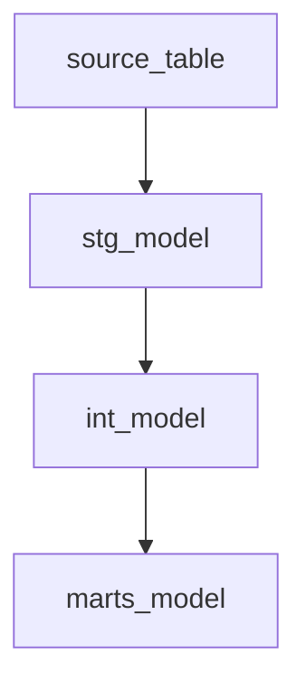

# /dbt_plan — Build The dbt Architecture Plan

Creates `dbt_plan.md` from `me_goals.md`, the KPI Framework Sheet, and enriched source YAMLs.
Use this after `/build_kpi_sheet` has produced the normalized KPI Framework artifacts.

The plan must describe what dbt models are needed to support Dalgo dashboards, metrics, charts, filters, drilldowns, and alerts. The dashboard layer should not need to perform core metric calculations.

Treat the text after `/dbt_plan` as optional source YAML paths.

---

## Step 0 — Resolve Engagement And Inputs

Resolve `{engagement}` in this order:

1. If the command is run from inside `workdocs/consulting/{engagement}/...`, use that engagement.
2. If source YAML paths are provided and all are under one engagement folder, use that engagement.
3. If `workdocs/consulting/*/framework/phase3_metadata.json` has exactly one recent KPI Framework metadata file, ask the user to confirm it.
4. Otherwise ask:
   > "Which engagement should `/dbt_plan` use?"

Validate:
- `workdocs/consulting/{engagement}/discovery/me_goals.md` exists.
- `workdocs/consulting/{engagement}/framework/phase3_metadata.json` exists or the user can provide a KPI Framework Sheet URL.
- The relevant enriched source YAML files exist.

If source YAML paths were not provided, find likely YAML files from:
- paths stored in metadata, if present
- `workdocs/consulting/{engagement}/data_exploration/`
- the dbt repo recorded in `me_goals.md`

If multiple unrelated YAML files are found, ask the user which ones to use.

Read fully:
- `{me_goals_path}`
- all `{sources_paths}`
- `workdocs/consulting/{engagement}/framework/kpi_framework.md` and `.json`, after refreshing them via the `read_kpi_framework` skill

---

## Step 1 — Refresh The KPI Framework Local Copy

Invoke the `read_kpi_framework` skill.

If the KPI Framework Sheet cannot be read, stop. Do not build a dbt plan from stale or missing KPI Framework data unless the user explicitly chooses a local `kpi_framework.json` fallback.

---

## Step 2 — Validate Framework Completeness

Before writing the plan, check:

- Every KPI row has `kpi_id`, `kpi_name`, `calculation_logic`, `source_tables`, `grain`, and `mart_model`.
- Every chart/visual row has `visual_type`, `kpi_ids`, `grain_needed`, and `mart_model`.
- Every dashboard output has `primary_kpis` and `required_filters`.
- Every reusable filter or drilldown has a source column or an open question.
- KPI rows marked `needs_client_input` are clearly listed as blockers or assumptions.

If critical implementation details are missing, continue only if the plan can mark them as assumptions or open questions. Do not pretend ambiguous KPI logic is confirmed.

---

## Step 3 — Design Model Layers

Design the dbt architecture in three layers:

### Staging

One model per raw source table when useful.

For each `stg_` model, specify:
- raw source table
- selected columns
- renamed columns
- type casts
- deduplication rule
- null handling
- JSON extraction or unnesting
- PII handling
- data-quality tests

### Intermediate

Business-entity and reusable transformation models.

For each `int_` model, specify:
- upstream staging models
- grain
- joins and cardinality expectations
- derived fields
- cohort logic
- aggregations
- fan-out risks
- validation checks

### Marts

Final chart-ready models used by Dalgo. Name these models with the `marts_` prefix.

For each `marts_` model, specify:
- upstream models
- output grain
- KPI IDs served
- visuals/dashboards served
- required columns
- metric calculations already materialized in the table
- filterable dimensions
- drilldown columns
- alert-support fields
- tests and validation queries

Avoid unnecessary bloat. Create separate long or wide `marts_` models only when different dashboard outputs genuinely need different shapes. Only create separate reusable lookup models when the charting contract explicitly requires them.

---

## Step 4 — Plan Shared Filters, Drilldowns, And Alerts

Create a dedicated filter plan:
- global filters required across dashboards
- dashboard-specific filters
- columns that must be present in each mart
- canonical dimension models for filter values
- drilldown paths such as program → district → center → beneficiary cohort
- any filter compatibility risks across charts

Create an alert plan:
- alert mart or fields needed
- threshold logic
- comparison period logic
- alert grain
- refresh cadence assumptions

---

## Step 5 — Identify Macro Candidates

List repeated logic that should become macros, such as:
- date parsing and validation
- fiscal year / quarter derivation
- yes/no normalization
- safe division
- age banding
- location normalization
- KPI numerator/denominator patterns
- deduplication helpers

For each macro candidate, include:
- proposed macro name
- purpose
- inputs
- models that would use it

---

## Step 6 — Write `dbt_plan.md`

Write:

```text
workdocs/consulting/{engagement}/framework/dbt_plan.md
```

Use this structure:

```markdown
# dbt Architecture Plan — {engagement_display}

## Inputs Reviewed
## Analytics Outputs To Support
## KPI Coverage Matrix
## Dashboard And Visual Requirements
## Source Data Summary
## Model Layer Plan
### Staging Models
### Intermediate Models
### Mart Models
## Model Dependency Graph
## Filter And Drilldown Plan
## Alert Plan
## Macro Candidates
## Data Quality And PII Considerations
## Implementation Order
## Validation Plan
## Assumptions And Open Questions
```

Include a Mermaid dependency graph using dbt model names:



---

## Step 7 — Update Metadata

Update `workdocs/consulting/{engagement}/framework/phase3_metadata.json` with:

```json
{
  "local_artifacts": {
    "dbt_plan": "workdocs/consulting/{engagement}/framework/dbt_plan.md"
  },
  "source_yaml_files": ["..."]
}
```

Preserve existing keys.

---

## Step 8 — Completion Summary

Print:

```text
✓ KPI Framework:  workdocs/consulting/{engagement}/framework/kpi_framework.md
✓ dbt plan:       workdocs/consulting/{engagement}/framework/dbt_plan.md
✓ source YAMLs:   {sources_paths}
✓ blockers:       {blocker_count}
```

Then print:
> "Review `dbt_plan.md`. Once accepted, run `/generate_er_diagram`."
