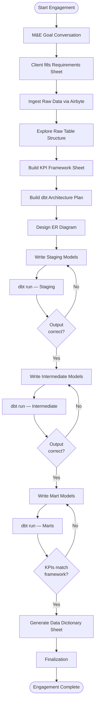
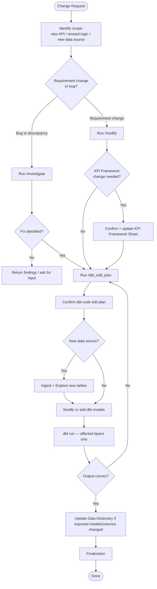

# Dalgo Consulting Process — dbt Model Development

This document captures the end-to-end consulting workflow for building dbt SQL models that transform raw NGO program data into insights and metrics. It is the reference for designing agentic skills around this workflow.

---

## Overview

The consulting engagement bridges two worlds: the client's M&E (Monitoring & Evaluation) logic, and the technical dbt data model that implements it. The workflow moves through four phases — **Discovery → Data Exploration → Framework → Model Development**.

The Requirements Sheet (a 4-tab Google Sheet workbook) is the single shared artifact for the entire engagement. It captures engagement context, data sources, and client metrics in one place. Raw data is then ingested and explored. Only after both are available does the consultant or LLM turn that input into the KPI Framework Sheet.

`me_goals.md` is generated by the LLM from all tabs of the Requirements Sheet and serves as the shared context document for all downstream phases — every skill from data exploration onward reads it as its primary input.

There are two tracks:
- **New engagement** — full four-phase process for a new client or program
- **Modification** — lightweight track for existing clients updating or adding metrics

---

## Flowchart — New Engagement



## Flowchart — Modification Track



---

## Phase 1: Discovery

**Goal:** Understand what the client is trying to measure and why, and capture all engagement context in a single shared workbook before any technical work begins.

### Steps

1. **M&E Goal Conversation**
   - Meet with client to understand program objectives and M&E goals per program/intervention.
   - Capture: program names, reporting cadence, audience (internal vs. donor), key questions the data must answer.
   - The consultant records this in the **Engagement Context tab** of the Requirements Sheet (not a separate document).

2. **Share Requirements Sheet with client**
   - Copy the Requirements Sheet template into the engagement's Drive folder and share it with the client.
   - The workbook has four tabs:
     - **Instructions** — column guide for the client; read-only reference
     - **Engagement Context** — consultant-filled: meeting notes, NGO website URL, program names, overall M&E goals
     - **Data Sources** — consultant-maintained after data ingestion: raw tables and columns the client can reference by name when describing KPI logic
     - **Metrics** — client-filled: one row per KPI with metric name, what is measured, calculation logic, data source, reporting audience, frequency, breakdown dimensions
   - The consultant adds annotations in the "Consultant Notes" column of the Metrics tab as the client fills it.
   - This workbook is updated in-place throughout the engagement — it is never recreated.

3. **Generate `me_goals.md`** (`/discover`)
   - After the client has filled the Metrics tab, the LLM reads all tabs of the Requirements Sheet and synthesises a structured summary.
   - Input: Requirements Sheet (all tabs — Engagement Context, Data Sources, Metrics)
   - Output: `me_goals.md` — the shared context document for all downstream phases. Every subsequent skill reads this file as its primary input before doing any work.

### Artifacts

| Artifact | Format | Owner | Purpose |
|---|---|---|---|
| Requirements Sheet | Google Sheet (4 tabs) | Consultant + Client | Single shared workbook for the engagement: engagement context, data source reference, and client metrics. Updated in-place throughout. |
| `me_goals.md` | Markdown | LLM | Structured summary synthesised from all tabs of the Requirements Sheet. Shared context for all downstream phases — every skill reads this first. |

---

## Phase 2: Data Exploration

**Goal:** Understand the actual shape of the raw data before the consultant or LLM turns the Requirements Sheet into the KPI Framework.

### Steps

3. **Ingest Raw Data**
   - Data sources (KoboToolbox, Google Sheets, ODK, CRMs, etc.) are ingested via Airbyte into raw tables in the warehouse by the consultant.
   - Confirm the source systems referenced in the Requirements Sheet are actually available.

4. **Explore Raw Table Structure** (`/explore_data`)
   - For each raw table, query to understand:
     - Column names and data types
     - Null rates and cardinality for key columns
     - Sample rows
     - Join keys (IDs linking tables)
     - Date/time fields and formats
     - Anomalies, duplicates, encoding issues
   - The command accepts one or more consultant-authored `source.yml` / `sources.yml` working files, or existing dbt source YAMLs from the dbt repo.
   - At the start, it reminds the consultant to ensure any required SSH tunnel is already running and captures the local tunnel port before warehouse validation.
   - It respects any consultant-marked PII columns already present in the YAML, does not inspect raw values from those columns during analysis, may infer additional likely PII heuristically, and does not store sample values for columns marked as PII.
   - Input: `me_goals.md` (for engagement context and metric intent), plus one or more passed `source.yml` / `sources.yml` files containing relevant raw tables and their schemas
   - Output: those same YAML files, enhanced and populated with table-level and column-level profiling information, explicit + inferred PII flags, and LLM notes to improve future usage and decision making

### Artifacts

| Artifact | Format | Owner | Purpose |
|---|---|---|---|
| `source.yml` / `sources.yml` | YAML | Consultant | Input for LLM to begin data exploration. May be one or more consultant-authored working files or existing dbt source YAMLs, with optional explicit PII flags already marked. |
| `source.yml` / `sources.yml` | YAML | LLM | The same YAML files, enriched with column profiles, explicit + inferred PII flags, date/join key notes, anomalies, and table summaries. |

---

## Phase 3: Framework

**Goal:** Translate the Requirements Sheet into a structured, implementation-ready KPI Framework using what was learned during data exploration.

**KPI Framework vs. Requirements Sheet — the distinction:**

The Requirements Sheet is written by the client in program/M&E language. It captures intent. The client does not need to know anything about databases to fill it.

The KPI Framework Sheet is built by the consultant in data/technical language. It captures implementation. It is written only after the raw table structure has been explored.

The KPI Framework is not just a flat list of KPIs. It is the analytics contract for Dalgo outputs: metrics, dashboards, charts, filters, drilldowns, alerts, grains, and source mappings. This contract gives `/dbt_plan` enough structure to design dbt models that already contain the required analytics, instead of pushing calculation work into the dashboard layer.

The same metric looks like this in each:

| | Requirements Sheet (client fills) | KPI Framework Sheet (consultant builds) |
|---|---|---|
| What it says | "% of female beneficiaries who completed the full training cycle — completions divided by enrolled, by gender, monthly, for donor report" | `COUNT(DISTINCT beneficiary_id WHERE gender='F' AND sessions_attended >= required_sessions) / COUNT(DISTINCT beneficiary_id WHERE gender='F')` — from `kobo_training_responses` joined to `enrollment_master` on `beneficiary_id`, filter `program_id = 'prog_x'`, grain: monthly per program, mart: `marts_training_completion` |
| Who can fill it | The M&E manager | The consultant or LLM, after data exploration |
| When it locks | After requirements review | After framework review, using explored raw data as input |

They are separate sheets because they have different audiences (client vs. data team) and different lifecycles (Requirements captures intent early; KPI Framework is the technical interpretation grounded in the real data shape).

### Steps

5. **Build the KPI Framework Sheet** (`/build_kpi_sheet`)
   - Build a multi-tab KPI Framework Sheet that organizes the user requirements from `me_goals.md` against the explored data reality from enriched source YAMLs.
   - Tabs:
     - **KPI Catalog** — one row per KPI/metric, with definition, formula, numerator/denominator, source tables, required columns, filters, grain, time grain, breakdown dimensions, mart model, status, change request metadata, and open questions.
     - **Dashboard Outputs** — one row per dashboard/page/section, with audience, decision supported, cadence, primary KPIs, required filters, and required drilldowns.
     - **Charts & Visuals** — one row per scorecard, chart, table, map, or operational view, with visual type, KPI IDs, grouping, metric, series/color dimension, required dimensions, default time window, grain needed, and mart model.
     - **Filters & Drilldowns** — reusable filters and drilldown paths, including source columns, canonical dimension models, allowed value logic, defaults, and whether they apply across all charts.
     - **Alerts** — thresholds or alert requirements, including KPI, condition, threshold, comparison period, audience, cadence, required grain, and mart model.
     - **Open Questions** — ambiguities that affect implementation, with suggested defaults and owners.
   - Status values for KPI Framework rows are **active**, **revised**, **deprecated**, and **needs_client_input**.
   - Chart type is captured at the visual level, not inferred only from the KPI. The same KPI may appear as a scorecard, trend line, district comparison, cohort table, or alert.
   - Input: `me_goals.md`, enriched `source.yml` / `sources.yml`
   - Output: KPI Framework Sheet (Google Sheet), `kpi_framework.md`, `kpi_framework.json`

6. **Build DBT Architecture Plan** (`/dbt_plan`)
   - Use the KPI Framework Sheet and `me_goals.md`, analyze the requirements around what dashboards/metrics/charts/alerts/KPIs are needed to be built on Dalgo - and designs a plan for what dbt models are going to be built, and the flow of information around the models.
   - DBT Models will be structure in three layers:
      - **staging** - The layer right above the sources - the models here will clean, deduplicate, rename columns etc. A basic layer of cleaning and staging before downstream models get involved in more complex analysis. 
      - **intermediate** - This layer is for intermediate processing. Joining, clean ups, aggregations, etc will happen in this layer. 
      - **marts** - The final layer of chart-ready `marts_` tables. These models will be used to build the final production dashboards/metrics/KPIs/charts/alerts. They should have all the required analytics performed on them already, as we aren't performing calculations on the dashboard layer. Design the tables so that they can be reused as needed across related charts/metrics/KPIs. Some charts might need long tables, while others need wide tables.
   - The plan will need to contain:
      - Which models are created in which layer.
      - Which models read from which other models.
      - What aggregations/joins/calculations need to happen in each models.
      - Concerns needed to be handled by the model (duplicates, bad date formatting etc)
      - Filters - dashboards will need filters that work across all the charts - so all the models will need to have the appropriate filterable columns. Include a filter plan in the md file.
      - Use macros for constantly reused logic - eg: validating date columns, converting dates to quarters/fiscal years etc
   - Input: `me_goals.md`, KPI Framework Sheet (Google Sheet), enriched `source.yml` / `sources.yml`
   - Output: `dbt_plan.md`

7. **Design ER Diagram** (`/generate_er_diagram`)
   - Use the KPI Framework Sheet and `dbt_plan.md` to decide which entities, joins, and dbt model boundaries are needed.
   - Document: entities and grain, relationships and cardinalities, which raw tables map to which entities, and the join paths needed for each KPI.
   - Input: `me_goals.md`, KPI Framework Sheet / `kpi_framework.json`, `dbt_plan.md`, enriched `source.yml` / `sources.yml`
   - Output: `er_diagram.md`

### Artifacts

| Artifact | Format | Owner | Purpose |
|---|---|---|---|
| KPI Framework Sheet | Google Sheet | Consultant | Multi-tab analytics contract for metrics, dashboards, charts, filters, drilldowns, alerts, grains, source mappings, and implementation questions. |
| `kpi_framework.md` | Markdown | LLM | Local readable copy of the KPI Framework Sheet for downstream commands. |
| `kpi_framework.json` | JSON | LLM | Local machine-readable copy of the KPI Framework Sheet for downstream commands and dbt wizard orchestration. |
| `dbt_plan.md` | Markdown | Consultant | A plan for the implementation and building of the dbt project, including model layers, dependencies, filter/drilldown support, alert support, macro candidates, validation, and open questions. |
| `er_diagram.md` / `.png` | Markdown / Image | Consultant | Entity-relationship diagram derived from the KPI Framework and `dbt_plan.md`, used to shape dbt models. |
---

## Phase 4: Model Development (dbt Medallion Architecture)

**Goal:** Build, run, verify, and iterate dbt models layer by layer.

The models follow a **staging → intermediate → mart** medallion pattern. Each layer is written and verified before proceeding to the next.

### Layer 1: Staging (`stg_`)

- One model per raw source table.
- Responsibilities: rename columns, cast data types, deduplicate, handle nulls. No business logic.
- For nested/JSON data: decide which fields to extract, how to handle arrays, consistent naming conventions.
- **Run & verify:** row counts match source, no unexpected nulls in key columns, data types correct.

### Layer 2: Intermediate (`int_`)

- Join and reshape staging models into business entities.
- Responsibilities: joins across staging models, cohort construction, derived fields (age from DOB, duration from start/end), light aggregations.
- **Run & verify:** validate join cardinalities, check for fan-out or row loss, spot-check derived fields.

### Layer 3: Marts (`marts_`)

- Final chart-ready models exposing metrics, filter columns, drilldown columns, and alert-support fields for reporting.
- Responsibilities: metric calculations per KPI Framework (aggregations, filters, period logic), dashboard-ready chart tables, reusable long/wide outputs as needed.
- **Run & verify:** compare computed metric values against manually calculated spot checks, validate against KPI Framework definitions.

### Development Loop (per layer)

```
write model → dbt run → inspect output in warehouse → correct logic → dbt run → confirm → proceed
```

### Data Dictionary (Final Deliverable)

At the end of model development, generate a **Data Dictionary Sheet** (Google Sheet) for the client. This is a structured reference of every table and column in the final dbt models.

Columns:
- **Schema** — `staging` / `intermediate` / `marts`
- **Table name** — full dbt model name
- **Column name**
- **Data type**
- **Description** — plain English definition (pulled from dbt YAML descriptions)
- **Example value** (optional)
- **Source** — raw table/column it originates from (for staging models)
- **KPI** — which KPI this column feeds (for mart models)

This sheet, alongside the dbt lineage and auto-generated dbt docs, is the handoff artifact to the client's data team. The sheet is also exported locally as `data_dictionary.md` and `data_dictionary.json` for review and dbt wizard orchestration.

### Finalization

This is the single final step after the Data Dictionary is generated, for both new engagements and modification work.

1. **Lint and fix all models**
   - Run SQLFluff across the full dbt model set, not just the files changed in the current task.
   - Fix lint violations before moving forward.

2. **Review and complete dbt YAML documentation**
   - Use AI to write or update model and column descriptions directly in dbt YAML files such as `schema.yml` or folder-level `.yml` files.
   - Ensure descriptions are clear enough for dbt docs and the client-facing Data Dictionary.
   - Documentation is authored directly as part of the model-development workflow.

3. **Run dbt docs generation**
   - Run dbt docs generation after dbt YAML documentation is stable.
   - Confirm the generated docs expose clear lineage and model descriptions.

4. **Create a new branch and open a GitHub PR to `main`**
   - All consulting code changes should be delivered on a dedicated git branch, not pushed directly to a shared branch.
   - If the dbt repo has a GitHub remote, ask before pushing the branch or opening a pull request against `main`.
   - The PR is the review and merge gate for both new-engagement work and modification work.

### Artifacts

| Artifact | Format | Owner | Purpose |
|---|---|---|---|
| `models/staging/stg_*.sql` | SQL | Engineer | Staging models |
| `models/intermediate/int_*.sql` | SQL | Engineer | Intermediate models |
| `models/marts/marts_*.sql` | SQL | Engineer | Chart-ready mart models |
| `models/schema.yml` / dbt `.yml` files | YAML | Engineer | Column descriptions, dbt tests, and AI-authored model documentation |
| dbt docs site | Generated | Engineer | Auto-generated lineage and documentation |
| Data Dictionary Sheet | Google Sheet | Engineer → Client | All tables and columns with definitions — client-facing handoff artifact |
| `data_dictionary.md` | Markdown | LLM | Local readable export of the Data Dictionary Sheet |
| `data_dictionary.json` | JSON | LLM | Local machine-readable export of the Data Dictionary Sheet |
| `phase4_metadata.json` | JSON | LLM | Phase 4 state file recording generated models, validation results, Data Dictionary Sheet ID, and finalization status |

---

## Full Artifact Map

```
workdocs/consulting/{engagement}/
├── discovery/
│   └── me_goals.md                ← LLM-generated from Requirements Sheet; shared context for all downstream phases
├── data_exploration/
│   └── sources.yml                ← optional consultant working copy; /explore_data can also target a dbt repo source.yml directly
├── framework/
│   ├── kpi_framework.md           ← local readable copy of KPI Framework Sheet
│   ├── kpi_framework.json         ← machine-readable contract for commands and dbt wizard
│   ├── dbt_plan.md                ← model architecture plan for Dalgo outputs
│   ├── er_diagram.md              ← entity-relationship diagram
│   └── phase3_metadata.json       ← sheet IDs, local artifact paths, source YAML paths
├── models/                        ← or inside the dbt project repo
│   ├── data_dictionary.md
│   ├── data_dictionary.json
│   ├── phase4_metadata.json
│   ├── staging/
│   ├── intermediate/
│   └── marts/
├── modifications/
│   └── {change}/
│       ├── change_request.md
│       ├── kpi_framework_patch.json
│       ├── dbt_edit_plan.md
│       └── modification_metadata.json
└── investigations/
    └── {issue}/
        ├── investigation.md
        ├── queries.sql
        └── investigation_metadata.json

Google Sheets (linked from workdocs, not stored as files):
├── Requirements Sheet             ← 4-tab workbook: Instructions / Engagement Context / Data Sources / Metrics
├── KPI Framework Sheet            ← multi-tab analytics contract for Dalgo outputs
└── Data Dictionary Sheet          ← generated at engagement close

YAML (in dbt project):
└── source.yml / sources.yml       ← one or more dbt source YAMLs that may be passed directly to /explore_data and enriched in place
```

---

## Modification Track (Existing Clients)

For clients already live on Dalgo who want to add or change metrics — no full re-engagement needed.

**Entry point:** A change request describing what needs to change (new KPI, revised formula, new data source, new breakdown dimension).

**Steps:**
1. Decide whether the request is a requirement change or a bug/discrepancy.
2. For requirement changes, run `/modify`. It creates a durable change folder, drafts KPI Framework edits only if needed, asks for confirmation before writing the Google Sheet, then calls `/dbt_edit_plan`.
3. For wrong numbers, duplicates, freshness issues, or dashboard discrepancies, run `/investigate`. It verifies warehouse access, writes every SQL query to `queries.sql`, and produces `investigation.md` with likely cause or inconclusive findings.
4. If a model fix is needed, run `/dbt_edit_plan` directly or from `/modify` / `/investigate`. It writes a durable `dbt_edit_plan.md` and asks for confirmation before editing dbt SQL, macros, source YAMLs, or dbt `.yml` files.
5. If the change involves a new data source: ingest via Airbyte, explore the new tables, and update the relevant `source.yml` / `sources.yml`.
6. If architecture changes, update `dbt_plan.md`. If relationships or join paths change, update `er_diagram.md`.
7. Modify only affected dbt model layers; do not rebuild the full model set unless the scope requires it.
8. Run dbt for affected models only. Verify output.
9. Update the Data Dictionary Sheet when exposed models or columns change.
10. Run the same **Finalization** step used in the new-engagement flow.

**Artifacts updated (not recreated):**
- `modifications/{change}/change_request.md`, `kpi_framework_patch.json`, `dbt_edit_plan.md`, `modification_metadata.json`
- `investigations/{issue}/investigation.md`, `queries.sql`, `investigation_metadata.json`
- KPI Framework Sheet — revised rows marked with date and change reason
- `dbt_plan.md` and `er_diagram.md` — updated when outputs, model boundaries, or relationships change
- Data Dictionary Sheet — updated columns/tables
- Affected SQL models and dbt `.yml` files only

---

## Key Principles

- **Requirements Sheet drives scope:** The client fills this once at the start and it is the input to the KPI Framework. Avoid scope creep by requiring changes to go through an explicit update to the Framework Sheet.
- **KPI Framework is the technical contract:** Every dbt model traces back to KPI, dashboard, visual, filter, drilldown, or alert requirements in the Framework Sheet. No model is written without a corresponding analytical output.
- **Analytics outputs shape the dbt plan:** Chart types, dashboard filters, drilldowns, and alerts are captured explicitly because they determine mart grain, dimensions, and reusable model boundaries.
- **Data exploration comes before KPI Framework authoring:** Business intent is captured upfront, raw tables are explored next, and only then is the KPI Framework written.
- **Data Dictionary is a client deliverable:** Not just internal documentation — it is the handoff artifact that lets the client's team understand and maintain their data independently.
- **Modification track is the default for live clients:** Once a client is set up, almost all work flows through the modification track. Avoid re-running the full process unless the program structure has fundamentally changed.
- **Requirement changes and bugs use different paths:** Requirement changes go through `/modify`; wrong numbers, duplicates, freshness issues, and dashboard discrepancies go through `/investigate`.
- **No unconfirmed edits:** `/modify` asks before writing KPI Framework changes, and `/dbt_edit_plan` asks before editing dbt SQL, macros, source YAMLs, or dbt `.yml` files.
- **Modification work is auditable:** Every change or investigation gets a durable folder with the request, plan, SQL run, results, and metadata.
- **GitHub delivery is explicit:** When the dbt repo has a GitHub remote, `/dbt_edit_plan` and `/finalize` ask before committing, pushing, or opening a PR.
- **Layer-by-layer verification:** Models are run and validated at each layer boundary before the next layer is written.
- **Finalization is mandatory:** After the Data Dictionary step, always run the single Finalization step before delivery.
- **Documentation is part of delivery, not cleanup:** Use AI to write clear dbt YAML model and column documentation directly, then generate dbt docs from it.
- **Lint the whole model set:** SQLFluff is run across all models for both new builds and modifications, and lint issues are fixed before the PR is opened.
- **Delivery is PR-based:** Consulting changes ship through a dedicated branch and GitHub pull request to `main`, never by direct push to a shared branch.
- **PII must not be exposed in artifacts:** `/explore_data` must respect consultant-marked PII columns, avoid raw-value inspection for them during analysis, may infer additional likely PII heuristically, and must not retain sample values for columns marked PII in the saved YAML.
- **NGO data quality is often poor:** Paper-to-digital conversion, inconsistent enumerators, mid-program schema changes. The staging layer must be defensive; document assumptions explicitly in `sources.yml` and dbt model `.yml` files.
