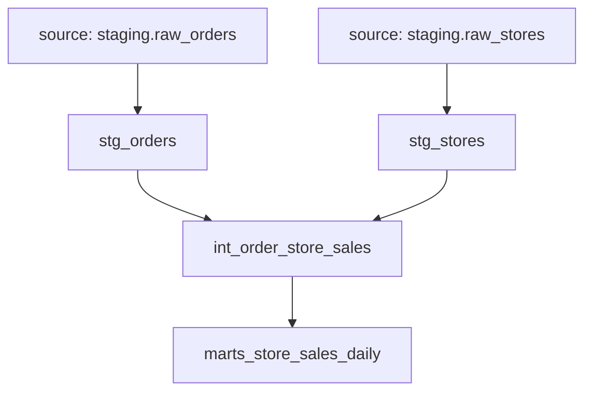

# dbt Architecture Plan — Demo Account Test

## Inputs Reviewed

- `workdocs/consulting/demoaccount_test/discovery/me_goals.md`
- `workdocs/consulting/demoaccount_test/framework/kpi_framework.json`
- `/Users/pratiksharao/code/dbt_demoaccount/models/sources/sources.yml`

## Analytics Outputs To Support

- A Store Sales Performance dashboard for internal program users.
- Daily store revenue monitoring.
- Monthly tax reporting with week and store breakdowns.

## KPI Coverage Matrix

| KPI ID | KPI Name | Mart Model | Status | Notes |
|---|---|---|---|---|
| kpi_001 | Gross Tax paid per store | marts_store_sales_daily | active | Uses calculated tax by default; raw `tax_paid` is retained for validation. |
| kpi_002 | Gross revenue generated per store | marts_store_sales_daily | active | Uses summed `order_total` by store and date. |

## Dashboard And Visual Requirements

| Visual ID | Output | Type | Required Grain | Mart |
|---|---|---|---|---|
| vis_001 | Gross revenue by store | bar_chart | store and day, aggregatable to period | marts_store_sales_daily |
| vis_002 | Daily gross revenue trend | line_chart | store and day | marts_store_sales_daily |
| vis_003 | Tax paid by store and week | stacked_bar | store and day, aggregatable to week | marts_store_sales_daily |

## Source Data Summary

| Source Table | Grain | Row Count | Primary Key | Join Keys | Notes |
|---|---|---:|---|---|---|
| staging.raw_orders | one row per order | 63148 | id | store_id | Business fields are text and need defensive casting. |
| staging.raw_stores | one row per store | 6 | id | id | Store lookup with name and tax rate. |

## Model Layer Plan

### Staging Models

| Model | Source Table | Selected Columns | Renames / Casts | Tests |
|---|---|---|---|---|
| stg_orders | staging.raw_orders | id, customer, store_id, subtotal, tax_paid, ordered_at, order_total, _airbyte_extracted_at | cast amounts to numeric; cast ordered_at to timestamp and date; keep customer only for lineage, not marts | unique/not_null order_id, not_null store_id, not_null order_date |
| stg_stores | staging.raw_stores | id, name, tax_rate, opened_at, _airbyte_extracted_at | rename id to store_id; name to store_name; cast tax_rate numeric and opened_at timestamp | unique/not_null store_id, not_null store_name |

PII handling: `customer` is treated as PII and is not selected into intermediate or mart models unless explicitly needed later.

### Intermediate Models

| Model | Upstream Models | Grain | Purpose | Fan-out Risk |
|---|---|---|---|---|
| int_order_store_sales | stg_orders, stg_stores | one row per order with store attributes | Join orders to stores on `store_id` and add store tax rate/name for reusable sales calculations. | Low, because `stg_stores.store_id` is unique and all profiled order store IDs matched a store. |

### Mart Models

| Model | Upstream Models | Output Grain | KPI IDs | Required Columns |
|---|---|---|---|---|
| marts_store_sales_daily | int_order_store_sales | one row per store per order_date | kpi_001, kpi_002 | order_date, week_start_date, order_month, store_id, store_name, order_count, gross_revenue, calculated_tax_paid, raw_tax_paid, tax_variance |

The mart should materialize numerator-style columns so the Dalgo dashboard does not need to perform core KPI calculations.

## Model Dependency Graph

## Filter And Drilldown Plan

| Filter / Drilldown | Column(s) | Models Required | Notes |
|---|---|---|---|
| Store Name | store_name | int_order_store_sales, marts_store_sales_daily | Shared filter across all dashboard visuals. |
| Order Date | order_date | stg_orders, int_order_store_sales, marts_store_sales_daily | Date range filter for trends and scorecards. |
| Month → Week → Day | order_month, week_start_date, order_date | marts_store_sales_daily | Supports tax reporting by week and revenue trends by day. |

## Alert Plan

No alert requirements are defined in the current Requirements Sheet or KPI Framework.

## Macro Candidates

| Macro | Purpose | Inputs | Models |
|---|---|---|---|
| safe_numeric | Convert blank or malformed text amounts to numeric safely. | column expression | stg_orders, stg_stores |
| safe_timestamp | Convert text timestamps to timestamp safely. | column expression | stg_orders, stg_stores |

For this small test project, repeated logic can stay inline unless additional source tables are added.

## Data Quality And PII Considerations

- `raw_orders.customer` is PII and should not be exposed in marts or client-facing artifacts.
- `order_total`, `subtotal`, `tax_paid`, and `tax_rate` are text in the source and must be cast defensively.
- The prior generated join used `raw_orders.order_total = raw_stores.id`; the correct join is `raw_orders.store_id = raw_stores.id`.
- `tax_paid` should be retained as a validation column because KPI logic currently specifies calculated tax from revenue and rate.

## Implementation Order

1. Add `stg_orders`.
2. Add `stg_stores`.
3. Add `int_order_store_sales`.
4. Add `marts_store_sales_daily`.
5. Document all generated models in dbt YAML.
6. Generate the local data dictionary.
7. Run final validation as allowed by the environment.

## Validation Plan

- Compile generated dbt models with the `health_demo` profile because `dbt_demoaccount` is missing from `~/.dbt/profiles.yml`.
- Compare `stg_orders` row count to `staging.raw_orders`.
- Confirm `stg_stores.store_id` is unique.
- Confirm `int_order_store_sales` does not lose or duplicate orders.
- Confirm `marts_store_sales_daily.gross_revenue` sums to staged order totals.
- Confirm no mart column exposes customer-level PII.

## Assumptions And Open Questions

- Assumption: Use `health_demo` only as test setup because the project profile is missing locally.
- Assumption: Calculated tax is `sum(order_total) * tax_rate` at the store-day grain.
- Open question: Confirm whether final tax reporting should use calculated tax or raw `tax_paid` when values differ.
- Open question: Customer, product, and net-profit analytics need future metric definitions before dbt models are added.
